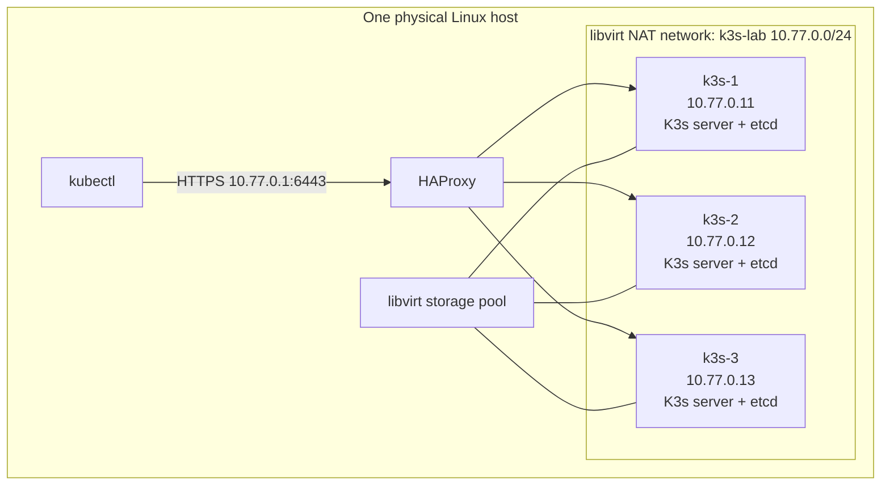
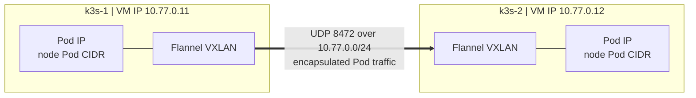

# Architecture

## Purpose and scope

This repository teaches Kubernetes platform infrastructure through small, reproducible exercises on a resource-constrained homelab. The first target is a highly available K3s control plane. A lightweight HTTP workload demonstrates Kubernetes scheduling, service routing, and recovery.

The intended production context is likely a managed cloud Kubernetes service. Operating K3s on VMs is a way to understand control-plane dependencies, failure modes, and trade-offs so that managed-service guarantees and responsibilities can be evaluated rather than assumed.

Each failure exercise should record the service impact, failed dependency, detection signal, recovery owner and action, and evidence that the service recovered. For managed services, also verify the provider's explicit guarantees, exclusions, and the workload owner's remaining responsibilities.

Kafka and other application platforms are out of scope for the initial checkpoints. The demo workload exists to make platform behaviour visible; it is not a separate application project.

## Initial topology

Terraform owns only the lab network, VM domains, and VM disks. The selected storage pool and host networking remain host-owned prerequisites. The tested host uses a pool named `extra` because that filesystem had suitable capacity, but the pool name and cloud-image path are local inputs rather than architectural requirements. The lab network uses NAT for guest egress and fixed DHCP reservations for stable guest addresses; it does not expose the VMs directly to the home LAN. VMs and the network are not configured to autostart with the host.

All three VMs run the K3s server role. Each provides Kubernetes control-plane components and participates in the embedded etcd datastore. Three etcd members require a quorum of two and can tolerate one member being unavailable.

The cluster API must have a stable endpoint reachable by clients when any one server is unavailable. The selected lab design is HAProxy on the libvirt host at `10.77.0.1:6443`, forwarding to the three K3s servers. The endpoint is outside the cluster and reachable from the host and lab guests; it is host-owned and does not provide host-level high availability.

## Workload and traffic

Kubernetes node addresses and Pod addresses belong to different network layers. The VM addresses below are fixed on the libvirt network. Flannel assigns a Pod CIDR to each node and carries traffic between those Pod CIDRs by encapsulating it in VXLAN packets sent between the VM addresses.

The diagram shows one cross-node path. K3s configures the same full-mesh VXLAN relationship among all three servers. The libvirt network routes VM traffic and guest egress; Flannel provides the overlay used for Pod-to-Pod traffic across nodes. A Kubernetes Service adds another virtual addressing and routing layer, implemented by cluster networking rather than by libvirt or HAProxy.

The planned Checkpoint 2 demo is a small HTTP responder deployed with multiple replicas. Responses will identify the serving Pod and, where practical, its node. A Kubernetes Service will provide a stable in-cluster address and route connections to ready Pods. The scheduler places Pods on nodes; the Service does not place workloads or guarantee that replicas occupy distinct nodes.

An external load balancer for the demo application is a separate exercise from the stable API endpoint. Begin with in-cluster Service routing and add external access only when its networking model is selected and documented.

## Failure model and limitations

- Loss of one K3s server leaves two etcd members, preserving quorum.
- Loss of two servers removes etcd quorum; normal control-plane writes are unavailable until quorum is restored.
- Workloads already running may continue during control-plane disruption, but scheduling and reconciliation are impaired.
- Replicated Pods can recover from an individual Pod or node failure only when sufficient healthy nodes and resources remain and the workload is configured with appropriate replicas and placement.
- All VMs share one physical host, power source, storage device, and host network. Physical-host failure takes down the entire lab.
- The physical host serves other personal workloads; lab VMs run on demand and must not be assumed to remain available between sessions.
- This is a learning environment, not a production service or a production availability claim.

## Resource and ownership boundaries

- The host and libvirt own the physical environment and storage pools.
- Terraform owns the lab NAT network, VM domains, and VM disks; it does not configure the host OS or manage Kubernetes workloads.
- K3s owns cluster control-plane and node services.
- Kubernetes manifests or Helm own demo workloads and their in-cluster resources.
- Local VM state, generated credentials, and secrets remain outside Git.

Use a libvirt pool with enough underlying filesystem capacity for VM disk growth. The tested path uses the `extra` pool, but users should select an existing suitable pool or follow the libvirt documentation to create one. Host memory, swap, disk, and CPU pressure must be measured during exercises.

Each VM is configured with two vCPUs, for six vCPUs total on a host with four physical cores and eight logical CPUs. These are schedulable virtual CPUs, not pinned or reserved physical cores; performance depends on concurrent host and guest workloads.
