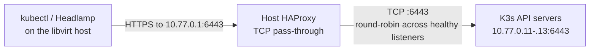

# Host HAProxy API Endpoint

## Status

The host HAProxy API endpoint on TCP `6443` was configured and validated for Checkpoint 1.

## Purpose and ownership

HAProxy is a host-owned service used for the stable K3s API endpoint on TCP `6443`. It is installed and configured on the libvirt host, not inside Kubernetes. It does not make the physical host highly available and is not used for demo application traffic.

The API endpoint is required by the [K3s HA cluster build runbook](k3s-ha-cluster.md) before the additional K3s servers join. Application traffic enters through the K3s ServiceLB and Traefik path documented in the [workload routing runbook](k3s-workload-routing.md).

The lab host is `10.77.0.1` on the private libvirt network; the K3s VMs are `10.77.0.11`, `10.77.0.12`, and `10.77.0.13`. UFW denies incoming traffic by default. The rules below allow only the libvirt subnet to reach the host listeners. The NAT network does not expose these listeners to the home LAN or Internet.

## Endpoint topologies

### Stable K3s API endpoint



HAProxy is outside Kubernetes in this flow. It provides one API address to clients while forwarding TCP connections to the server VMs; it does not terminate API TLS or make the physical host highly available.

## Install HAProxy

Run the commands on the libvirt host after the first K3s API server has been validated directly at `10.77.0.11:6443`:

```sh
sudo apt update
sudo apt install haproxy
```

Do not replace the package configuration. It contains useful global settings for the chroot, unprivileged `haproxy` user, admin stats socket, TLS defaults, and HTTP defaults. The packaged systemd service loads `/etc/haproxy/haproxy.cfg` and does not automatically load an apt-style `conf.d` directory.

Before each configuration change, back up the current file to a new, unique path. Do not overwrite an earlier backup:

```sh
sudo cp /etc/haproxy/haproxy.cfg /etc/haproxy/haproxy.cfg.before-k3s-api
```

If that backup path already exists, choose another name that records the date or change being made. Append the required named sections with `sudoedit /etc/haproxy/haproxy.cfg`, retaining the package configuration and any unrelated existing configuration.

## Configure the stable K3s API endpoint

Allow API connections from the lab subnet to the host endpoint:

```sh
sudo ufw status numbered
sudo ufw allow in from 10.77.0.0/24 to 10.77.0.1 port 6443 proto tcp comment 'K3s API via HAProxy (lab only)'
sudo ufw status numbered
```

If the exact lab rule already exists, keep it and do not add a duplicate.

Append these HAProxy sections to `/etc/haproxy/haproxy.cfg`:

```haproxy
defaults k3s_api_defaults
    mode tcp
    log global
    option tcplog
    option logasap
    timeout connect 5s
    timeout client 1h
    timeout server 1h

frontend k3s_api from k3s_api_defaults
    bind 10.77.0.1:6443
    default_backend k3s_api_servers

backend k3s_api_servers from k3s_api_defaults
    balance roundrobin
    option log-health-checks
    server k3s-1 10.77.0.11:6443 check inter 2s fall 2 rise 2
    server k3s-2 10.77.0.12:6443 check inter 2s fall 2 rise 2
    server k3s-3 10.77.0.13:6443 check inter 2s fall 2 rise 2
```

Validate the complete file before reloading the service:

```sh
sudo haproxy -c -f /etc/haproxy/haproxy.cfg
sudo systemctl reload haproxy
sudo systemctl is-active haproxy
```

Update the host-side kubeconfig and verify the API through the stable endpoint before allowing K3s joiners to use it:

```sh
kubectl --kubeconfig "$HOME/.kube/k3s-lab.yaml" config set-cluster default --server=https://10.77.0.1:6443
test "$(kubectl --kubeconfig "$HOME/.kube/k3s-lab.yaml" config view --minify -o jsonpath='{.clusters[0].cluster.server}')" = 'https://10.77.0.1:6443'
kubectl --kubeconfig "$HOME/.kube/k3s-lab.yaml" get nodes
kubectl --kubeconfig "$HOME/.kube/k3s-lab.yaml" get --raw='/readyz?verbose'
```

The API listener is TCP pass-through; HAProxy does not terminate TLS or inspect Kubernetes requests. TCP health checks verify that a backend accepts connections, not that etcd or the API is fully ready. The API validation commands check readiness separately. HAProxy logs are written to `/var/log/haproxy.log` by the Ubuntu package:

```sh
sudo tail -f /var/log/haproxy.log
```

## Roll back the K3s API endpoint

The API endpoint is required while clients or joiners use `https://10.77.0.1:6443`. First point those clients at a valid API endpoint or stop using them, then inspect the numbered rules and remove only the rule with comment `K3s API via HAProxy (lab only)`:

```sh
sudo ufw status numbered
read -r -p 'UFW rule number for K3s API: ' rule_number
test -n "$rule_number"
sudo ufw delete "$rule_number"
```

Remove only `k3s_api_defaults`, `k3s_api`, and `k3s_api_servers` from the configuration. Validate and reload:

```sh
sudo haproxy -c -f /etc/haproxy/haproxy.cfg
sudo systemctl reload haproxy
```

Do not restore a backup over later intentional HAProxy changes. Removing the HAProxy package is optional and outside this lab's cleanup because the package and service are host-owned and may serve other configurations. Terraform cleanup does not remove host-owned HAProxy configuration or UFW rules.
