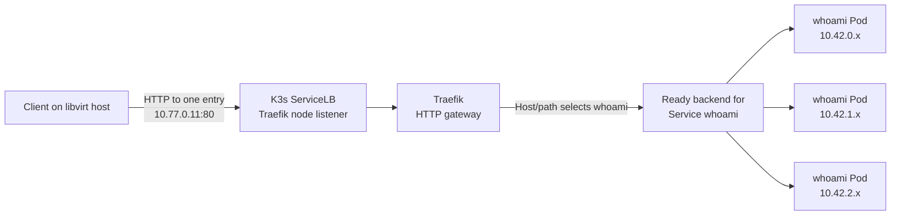
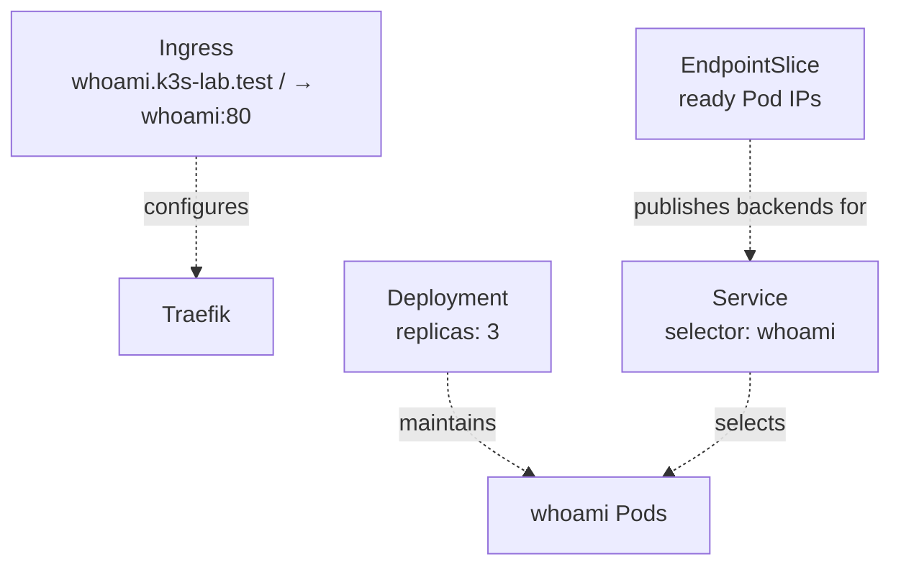

# K3s Workload Routing and Scheduling

## Status

Checkpoint 2 was validated by the owner on 2026-10-10. The manifest was applied first with one replica and then with three; the temporary in-cluster client reached the single responder and then different responders through the Service. All three Pods were Ready and, in the initial run without a placement constraint, landed one per node. The EndpointSlice listed the three Pod endpoints, Pod deletion/recreation was observed with `--watch`, and `kubectl top` returned node and Pod metrics. Repeated host requests entered through only `10.77.0.11:80` and returned HTTP `200` from Pods at `10.42.0.12`, `10.42.1.7`, and `10.42.2.8`, proving that one Traefik entry listener can reach ready application Pods across all three nodes. The observed Traefik Deployment had one Pod on `k3s-1`; this exercise validates routing, not ingress-controller high availability. Node-level failure validation remains in Checkpoint 3.

## Purpose and scope

This runbook introduces Kubernetes workload configuration using a small HTTP responder. You will find its YAML in the repository, change the desired replica count, apply that configuration through the Kubernetes API, and inspect the Pods, their nodes, Service endpoints, events, and current resource use. The exercises prepare for Checkpoint 3, which validates recovery during real node and workload failures.

The demo is intentionally small and does not configure persistent storage, TLS, autoscaling, monitoring, or access from the home LAN or Internet. Its Ingress is reachable from the libvirt host through the lab VM addresses. All three VMs share one physical host, so the lab demonstrates node-level control-plane resilience, not host-level high availability.

## Kubernetes objects and configuration flow

The workload configuration is stored in versioned manifests under `kubernetes/demo/`: [`whoami.yaml`](../../kubernetes/demo/whoami.yaml) defines the Namespace, Deployment, and ClusterIP Service, while [`whoami-ingress.yaml`](../../kubernetes/demo/whoami-ingress.yaml) defines the HTTP route through Traefik. The `kubectl` kubeconfig is stored separately at `$HOME/.kube/k3s-lab.yaml`; it contains API access details and credentials, not the workload definition, and must remain private and outside Git.

The Deployment describes the desired Pod count and template. Kubernetes creates a ReplicaSet to maintain that count, and the scheduler assigns each new Pod to an eligible node. The Service selects Pods by label and routes connections to ready endpoints. The Service does not create or place Pods. K3s's control plane continually reconciles observed state toward the desired state in the API.

The normal learning loop is: edit the YAML in the repository, review the change, run `kubectl apply -f kubernetes/demo/whoami.yaml` with the lab kubeconfig, then inspect the live resources with `kubectl get`, `kubectl describe`, and events. Applying sends the manifest to the Kubernetes API server; it does not automatically commit the YAML to Git. Git records and reviews the source configuration, while the cluster stores and reconciles its live desired state. This lab uses direct `kubectl apply`; it does not configure a GitOps controller.

## Prerequisites

- Complete the [K3s HA build runbook](k3s-ha-cluster.md) and [failure/restart validation](k3s-ha-validation.md); all three nodes should be `Ready`.
- Run commands from the repository root on the libvirt host and use the private kubeconfig at `$HOME/.kube/k3s-lab.yaml`.
- Confirm the cluster can pull the `traefik/whoami:v1.11.0` image from its container registry.
- Confirm the packaged IngressClass is named `traefik` and the Traefik LoadBalancer Service advertises the lab VM addresses.

Check which cluster context the kubeconfig selects before applying changes:

```sh
kubectl --kubeconfig "$HOME/.kube/k3s-lab.yaml" config current-context
kubectl --kubeconfig "$HOME/.kube/k3s-lab.yaml" get nodes -o wide
kubectl --kubeconfig "$HOME/.kube/k3s-lab.yaml" get ingressclass
kubectl --kubeconfig "$HOME/.kube/k3s-lab.yaml" -n kube-system get service traefik -o wide
```

## Deploy one replica

The manifest in this checkpoint ends with three replicas. To begin with one, edit `kubernetes/demo/whoami.yaml` and change `spec.replicas` under `Deployment/whoami` from `3` to `1`. Review the exact change, then apply it:

```sh
git diff -- kubernetes/demo/whoami.yaml
kubectl --kubeconfig "$HOME/.kube/k3s-lab.yaml" apply -f kubernetes/demo/whoami.yaml
kubectl --kubeconfig "$HOME/.kube/k3s-lab.yaml" -n platform-demo rollout status deployment/whoami
```

The manifest creates namespace `platform-demo`, one HTTP Pod, and a ClusterIP Service. The container listens on TCP `80` inside its Pod. No VM port or host port is allocated.

Inspect the resources and the node chosen by the scheduler:

```sh
kubectl --kubeconfig "$HOME/.kube/k3s-lab.yaml" -n platform-demo get deployment,replicaset,pods,service,endpointslices -o wide
kubectl --kubeconfig "$HOME/.kube/k3s-lab.yaml" -n platform-demo get pods -o wide --watch
```

The `NODE` column identifies where the Pod is running. With one replica and no placement constraint, the scheduler chooses any eligible node. Capture the Pod name and node; this is the starting point for observing scheduling.

## Send requests through the Service

Run a temporary client Pod inside the cluster and send requests to the Service's DNS name:

```sh
kubectl --kubeconfig "$HOME/.kube/k3s-lab.yaml" -n platform-demo run service-check --rm -i --restart=Never --image=curlimages/curl:8.12.1 --command -- sh -c 'for request in $(seq 1 10); do curl --fail --silent --show-error http://whoami.platform-demo.svc.cluster.local/; done'
```

Each response includes the serving Pod's hostname. At one replica, every response should identify the same Pod. With three replicas, responses should eventually show different hostnames; repeat the requests if a short sample happens to reach the same Pod. A particular request order or strict round-robin sequence is not guaranteed. The temporary client is removed when the command finishes; neither the Service nor the demo listens on a host port. If the image pull is delayed, inspect the temporary Pod's events before retrying.

## Increase to three replicas

Edit the same repository file and change `spec.replicas` under `Deployment/whoami` back to `3`. Review and apply the desired-state change:

```sh
git diff -- kubernetes/demo/whoami.yaml
kubectl --kubeconfig "$HOME/.kube/k3s-lab.yaml" apply -f kubernetes/demo/whoami.yaml
kubectl --kubeconfig "$HOME/.kube/k3s-lab.yaml" -n platform-demo rollout status deployment/whoami
kubectl --kubeconfig "$HOME/.kube/k3s-lab.yaml" -n platform-demo get pods -o wide
```

The Deployment now asks for three Pods. The scheduler may place them on one, two, or three nodes; replicas alone do not guarantee distribution across nodes. Repeat the temporary in-cluster client command from the previous section. Different response hostnames show that the Service is routing to different ready Pods. A particular request order or strict round-robin sequence is not guaranteed.

Inspect the Service's current ready backends:

```sh
kubectl --kubeconfig "$HOME/.kube/k3s-lab.yaml" -n platform-demo get endpointslices -l kubernetes.io/service-name=whoami -o yaml
```

The EndpointSlice should list ready Pod addresses selected by the Service. If it is empty, check the Service selector, Pod labels, readiness, and recent events.

## Route host traffic through Traefik

The packaged Traefik controller is exposed by K3s ServiceLB. Its LoadBalancer Service advertises `10.77.0.11`, `10.77.0.12`, and `10.77.0.13`, but these addresses are equivalent entry listeners for the same Traefik gateway; they do not map one-to-one to the `whoami` Pods or constrain a request to Pods on that node. Entering through any one listener allows Traefik and the application Service to reach any ready `whoami` Pod across the cluster. The first address is used consistently below so the test demonstrates Kubernetes routing rather than node-listener availability.



This is the data path: the request enters once, and the cluster networking can reach a ready backend on any node. The control plane is not a request hop; it reconciles the objects that configure this path. The Ingress tells Traefik which Service matches the Host/path, the Service selector identifies the application Pods, and the EndpointSlice records their ready IPs. An Ingress controller may use those endpoints directly rather than sending packets through the Service ClusterIP, but the Service remains the stable application abstraction.



These dotted relationships are configuration and reconciliation, not additional packet hops.

Before adding an Ingress rule, this request should reach Traefik and return its default `404` because no matching route exists yet:

```sh
curl --include --connect-timeout 2 http://10.77.0.11/
```

Apply the versioned Ingress resource after the `whoami` Service exists:

```sh
kubectl --kubeconfig "$HOME/.kube/k3s-lab.yaml" apply -f kubernetes/demo/whoami-ingress.yaml
kubectl --kubeconfig "$HOME/.kube/k3s-lab.yaml" -n platform-demo get ingress
kubectl --kubeconfig "$HOME/.kube/k3s-lab.yaml" -n platform-demo describe ingress whoami
```

The rule matches the HTTP Host `whoami.k3s-lab.test` and forwards requests to Service `whoami` on port `80`. `curl --resolve` supplies a temporary hostname-to-IP mapping for this command, so there is no need to edit `/etc/hosts` or configure DNS. Send repeated requests to one Traefik entry listener and print the serving Pod IP:

```sh
for request in $(seq 1 10); do curl --silent --fail --show-error --resolve 'whoami.k3s-lab.test:80:10.77.0.11' http://whoami.k3s-lab.test/ | grep '^IP: ' | grep -Ev '^IP: (127\.0\.0\.1|::1|fe80:)'; done
```

The filters retain reported interface addresses while excluding IPv4/IPv6 loopback and link-local IPv6; they do not assume a fixed Pod CIDR. Compare the output with `kubectl get pods -o wide`. It should eventually identify Pods on different nodes while every request still enters through `10.77.0.11`; in the validated cluster those addresses used the `10.42.0.x`, `10.42.1.x`, and `10.42.2.x` node Pod CIDRs. This demonstrates that the entry node is not the application backend: Traefik applies the Ingress rule and uses the ready backends represented by the `whoami` Service. It does not guarantee strict round-robin order. If the connection times out, check host-to-VM reachability and the Traefik LoadBalancer/ServiceLB Pods. If Traefik returns `404`, check the IngressClass, Host header, rule, and namespace Service name/port. The other advertised node IPs are alternate listeners useful for later failure testing, not addresses the application consumer must iterate.

## Observe reconciliation and scheduler decisions

In one terminal, watch Pod creation, readiness, restarts, and node placement:

```sh
kubectl --kubeconfig "$HOME/.kube/k3s-lab.yaml" -n platform-demo get pods -o wide --watch
```

In another terminal, inspect recent namespace events:

```sh
kubectl --kubeconfig "$HOME/.kube/k3s-lab.yaml" -n platform-demo get events --sort-by=.metadata.creationTimestamp
```

Deleting a healthy Pod is a controller-reconciliation exercise, not a way to capture an application crash. First choose a Pod name from `get pods -o wide`, inspect it, and capture its current logs and events before deletion. The interactive prompt avoids accidentally selecting a different Pod:

```sh
read -r -p 'Pod name to inspect and delete: ' pod_name
test -n "$pod_name"
kubectl --kubeconfig "$HOME/.kube/k3s-lab.yaml" -n platform-demo describe pod "$pod_name"
kubectl --kubeconfig "$HOME/.kube/k3s-lab.yaml" -n platform-demo logs "$pod_name" --all-containers=true
kubectl --kubeconfig "$HOME/.kube/k3s-lab.yaml" -n platform-demo get events --sort-by=.metadata.creationTimestamp
```

If `RESTARTS` is greater than zero and a container previously crashed in this still-existing Pod, retrieve that previous container instance's logs before deleting the Pod:

```sh
kubectl --kubeconfig "$HOME/.kube/k3s-lab.yaml" -n platform-demo logs "$pod_name" --all-containers=true --previous
```

Now delete the selected Pod and observe the replacement:

```sh
kubectl --kubeconfig "$HOME/.kube/k3s-lab.yaml" -n platform-demo delete pod "$pod_name"
```

The ReplicaSet creates a replacement Pod with a new name. The scheduler selects a suitable node, which may be the same node or a different one. The `Scheduled` event records the chosen node. The Service stops using a Pod when it is not ready and uses ready replicas. Repeat the HTTP requests to check that traffic still reaches the available replicas.

This is replacement, not moving the same Pod. During an actual node failure, Kubernetes first has to detect the missing node; the old Pod can remain assigned to that node while it is unavailable. With one replica, the Service can have no ready backend until a replacement is scheduled and becomes ready. With three replicas, service traffic can continue through other ready replicas, provided replicas are not all lost together and remaining nodes have capacity. The complete node shutdown exercise belongs to Checkpoint 3; do not shut down a VM as part of this Checkpoint 2 runbook.

Troubleshooting depends on the Pod's current state. For a Pod that still exists, select its name from `kubectl get pods -o wide` and inspect its description, logs, and events before deleting or replacing it:

```sh
read -r -p 'Pod name to inspect: ' pod_name
test -n "$pod_name"
kubectl --kubeconfig "$HOME/.kube/k3s-lab.yaml" -n platform-demo describe pod "$pod_name"
kubectl --kubeconfig "$HOME/.kube/k3s-lab.yaml" -n platform-demo logs "$pod_name" --all-containers=true
kubectl --kubeconfig "$HOME/.kube/k3s-lab.yaml" -n platform-demo get events --sort-by=.metadata.creationTimestamp
```

For `CrashLoopBackOff` or a non-zero restart count, also inspect the previous container instance with `kubectl logs "$pod_name" --all-containers=true --previous`; this only works while the Pod still exists and its previous container logs are available. `FailedScheduling` events commonly indicate insufficient allocatable resources, node taints, or placement constraints. `ImagePullBackOff` events point to image name, registry access, or credentials. A Pod that is `Running` but absent from Service endpoints may not be Ready; inspect its readiness probe, labels, and the Service's EndpointSlice.

If a Pod was explicitly deleted and its replacement has already appeared, `describe` and `logs` against the old name return `NotFound`: the old Pod object and its container-local logs are gone. Recent Kubernetes events may still record scheduling, deletion, and replacement, but events expire and are not durable logs. For retained application logs after Pod deletion, a cluster needs centralized logging; this lab does not install that component. The `whoami` Pod is a healthy test server, so manually deleting it should not produce an application traceback.

## Inspect current resource pressure

K3s includes metrics-server. Check recent node and Pod CPU/memory use with:

```sh
kubectl --kubeconfig "$HOME/.kube/k3s-lab.yaml" top nodes
kubectl --kubeconfig "$HOME/.kube/k3s-lab.yaml" -n platform-demo top pods
```

These are current samples, not historical graphs. If metrics are unavailable, inspect the metrics-server Deployment and its Pods using the lab kubeconfig. To compare current use with capacity, scheduling reservations, and node conditions, inspect:

```sh
kubectl --kubeconfig "$HOME/.kube/k3s-lab.yaml" -n kube-system get deployment,pods -l k8s-app=metrics-server
kubectl --kubeconfig "$HOME/.kube/k3s-lab.yaml" describe nodes
kubectl --kubeconfig "$HOME/.kube/k3s-lab.yaml" get nodes
```

`describe nodes` includes conditions such as `MemoryPressure`, `DiskPressure`, and `PIDPressure`, allocatable capacity, and requested/limited resources. `kubectl top` shows recent observed use; requests and limits describe scheduling reservations and container caps, not actual use. Do not create artificial node overload in this checkpoint.

For a visual cluster view without installing an observability stack into K3s, Headlamp Desktop can connect using the same host-side kubeconfig. Treat that kubeconfig as an administrator credential and keep it private. The runbook uses standard `kubectl` commands and does not depend on a dashboard.

## Placement-rule follow-up

The initial manifest deliberately has no placement constraint. To spread three replicas across eligible nodes, add this block under `spec.template.spec` in the Deployment in `kubernetes/demo/whoami.yaml`, then apply the manifest and inspect `kubectl get pods -o wide`:

```yaml
      topologySpreadConstraints:
        - maxSkew: 1
          topologyKey: kubernetes.io/hostname
          whenUnsatisfiable: DoNotSchedule
          labelSelector:
            matchLabels:
              app.kubernetes.io/name: whoami
```

With three eligible nodes and three replicas, this hard rule requires the Pods to spread across nodes. The same rule can leave a Pod Pending if a node failure or resource shortage leaves no eligible placement. Check `FailedScheduling` events and decide the intended failure behaviour before keeping the rule. Remove the block and apply the manifest to return to unconstrained scheduling.

## Version and apply the final configuration

After the exercises, restore `spec.replicas: 3` in `kubernetes/demo/whoami.yaml` and inspect the source change:

```sh
git diff -- kubernetes/demo/whoami.yaml
kubectl --kubeconfig "$HOME/.kube/k3s-lab.yaml" apply -f kubernetes/demo/whoami.yaml
kubectl --kubeconfig "$HOME/.kube/k3s-lab.yaml" -n platform-demo rollout status deployment/whoami
```

Keep the reviewed manifest in Git so another operator can inspect and reproduce the desired configuration. Applying it updates the live objects through the API; it does not itself create a Git commit. Do not commit the kubeconfig or other credentials.

## Cleanup and exit evidence

Remove the Ingress route, then the demo namespace and its remaining resources:

```sh
kubectl --kubeconfig "$HOME/.kube/k3s-lab.yaml" delete -f kubernetes/demo/whoami-ingress.yaml
kubectl --kubeconfig "$HOME/.kube/k3s-lab.yaml" delete -f kubernetes/demo/whoami.yaml
```

Record the one-Pod starting placement, the three-Pod placement, successful responses from replicas through the Service and host-side Ingress, replacement-Pod scheduling evidence, the ready EndpointSlice, and current resource observations. Checkpoint 2 is complete when in-cluster and host-side requests reach the HTTP workload through their documented routes. Controlled node-failure recovery is validated in Checkpoint 3.
